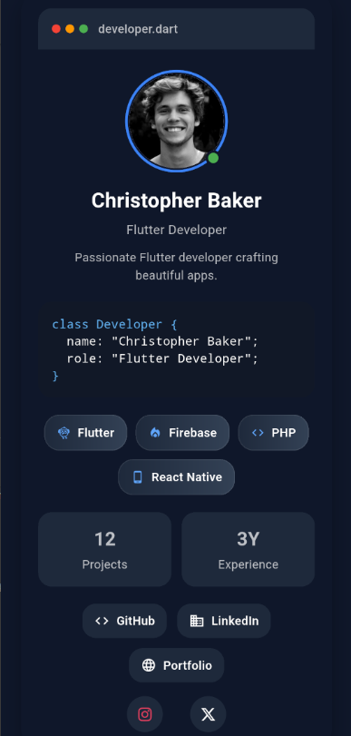

# Developer Card Lift 🚀

A beautiful, modern, and customizable Flutter developer profile card inspired by VS Code aesthetics.

Perfect for portfolio apps, developer showcases, resumes, profile pages, and personal branding.


---

## ✨ Features

- 🎨 Modern VS Code inspired design
- 👤 Developer avatar with online indicator
- 💼 Professional role & bio section
- 🛠 Dynamic skill chips
- 📊 Developer statistics
- 🔗 GitHub, LinkedIn & Portfolio links
- 📱 Instagram, WhatsApp & X (Twitter) support
- 🌙 Dark theme optimized
- ⚡ Responsive mobile layout
- 🎯 Easy customization
- 🚀 Production ready

---

## 📦 Installation

Add the dependency:

```yaml
dependencies:
  developer_card_lift: ^1.0.0
```

Run:

```bash
flutter pub get
```

---

## 🚀 Usage

```dart
DeveloperCardLift(
  name: 'Christopher Baker',
  role: 'Flutter Developer',

  bio: 'Passionate Flutter developer crafting beautiful apps.',

  avatar: const NetworkImage(
    'https://i.pravatar.cc/300',
  ),

  githubUrl: 'https://github.com/christopherbaker',
  linkedinUrl: 'https://linkedin.com/in/christopherbaker',
  portfolioUrl: 'https://christopherbaker.dev',

  instagramUrl: 'https://instagram.com/christopherbaker',
  twitterUrl: 'https://x.com/christopherbaker',
  whatsappUrl: 'https://wa.me/1234567890',

  projects: 12,
  experience: '3Y',

  skills: const [
    DeveloperSkill(
      label: 'Flutter',
      icon: Icons.flutter_dash,
    ),
    DeveloperSkill(
      label: 'Firebase',
      icon: Icons.local_fire_department,
    ),
    DeveloperSkill(
      label: 'PHP',
      icon: Icons.code,
    ),
    DeveloperSkill(
      label: 'React Native',
      icon: Icons.phone_android,
    ),
  ],
)
```

---

## 📸 Preview

### Mobile

<p>
  
</p>

---

## 🎯 Use Cases

- Developer Portfolio Apps
- Resume Applications
- Team Member Profiles
- Startup Landing Pages
- Personal Branding
- Freelancer Profiles
- Open Source Contributor Showcases

---

## 🛠 Customization

Developer Card Lift allows you to configure:

- Name
- Role
- Bio
- Avatar
- Skills
- Statistics
- Social Media Links
- Portfolio Links

---

## ❤️ Why Developer Card Lift?

Most profile card widgets look generic.

Developer Card Lift provides a developer-focused UI with a modern coding aesthetic inspired by professional developer tools.

---

## 🤝 Contributing

Contributions, issues, and feature requests are welcome.

Feel free to open an issue or submit a pull request.

---

## 📄 License

This project is licensed under the MIT License.

See the LICENSE file for details.

## GitHub

GitHub Repository:
https://github.com/Sakshi-2508/developer_card_lift

## Package
pub.dev:
https://pub.dev/packages/developer_card_lift
---

Made with ❤️ using Flutter.
